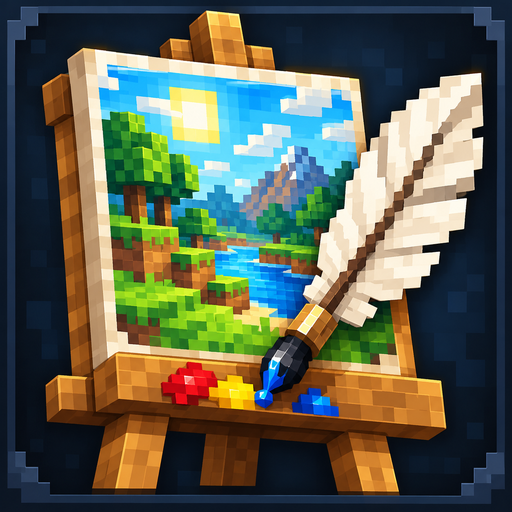

# Canvas Studio+

<p align="center"></p>

**made by SuprixZ**

Canvas Studio+ **2.1.2 for Minecraft 26.2** lets you draw, import PNG/JPEG images, export PNG artwork, save custom paintings, and match drawings to Minecraft items and blocks offline.

## Download 2.1.2 for Minecraft 26.2

[Release page](https://github.com/SupremeGenZ-Github/Canvas-Studio/releases/tag/v2.1.2-mc26.2) · [JAR](https://github.com/SupremeGenZ-Github/Canvas-Studio/releases/download/v2.1.2-mc26.2/canvas-studio-plus-26.2-2.1.2.jar) · [Source ZIP](https://github.com/SupremeGenZ-Github/Canvas-Studio/releases/download/v2.1.2-mc26.2/Canvas-Studio-Plus-2.1.2-MC26.2-source.zip)

## Requirements and installation

Minecraft Java **26.2**, **Java 25**, and **NeoForge 26.2.0.88**. This separate port targets that exact NeoForge version; 26.3 users should use the original 26.3 JAR. Other loaders and Minecraft versions are unsupported. Source lives on the `minecraft-26.2` branch. See [VALIDATION.md](VALIDATION.md) for actual checks.

Put the JAR in your instance's `mods` folder. Remove previous Canvas Studio JARs first. Install **one edition only**: Canvas Studio Lite, Canvas Studio, and Canvas Studio+ all use `canvasstudio`. Servers and clients require the same release; 2.1.2 uses network protocol 3 and cannot mix with 2.0.x.

Canvas Studio Lite 1.0.4 remains the painting-only edition on the `lite` branch. This port lives on `minecraft-26.2`; the 26.3 edition remains on `main`; older releases remain available in [GitHub Releases](https://github.com/SupremeGenZ-Github/Canvas-Studio/releases).

## Crafting

| Result | Ingredients | Recipe type | Get Item |
| --- | --- | --- | --- |
| Quill | Feather + Ink Sac | Shapeless | — |
| Blank Canvas | Leather + Paper + Quill | Shapeless | Locked |
| Molten Quill | Quill in center; four Iron Ingots in corners, four Gold Ingots on edge centers | Shaped, all nine slots | — |
| Infinity Quill | Molten Quill in center; four Echo Shards in corners, Lapis Blocks on left/right, Diamond Blocks on top/bottom | Shaped, all nine slots | — |
| Molten Canvas | Blank Canvas + Molten Quill + Compass | Shapeless | One successful exchange |
| Infinity Canvas | Molten Canvas + Infinity Quill + Recovery Compass | Shapeless | Unlimited successful exchanges |

The former Leather + Paper + Feather shortcut has been removed, including its advancement. The normal Quill recipe remains. Molten and Infinity canvases are upgrades of the previous canvas tier. Quill layouts fill all nine slots:

| Molten Quill | | |
| --- | --- | --- |
| Iron Ingot | Gold Ingot | Iron Ingot |
| Gold Ingot | Quill | Gold Ingot |
| Iron Ingot | Gold Ingot | Iron Ingot |

| Infinity Quill | | |
| --- | --- | --- |
| Echo Shard | Diamond Block | Echo Shard |
| Lapis Block | Molten Quill | Lapis Block |
| Echo Shard | Diamond Block | Echo Shard |

## Painting

Use any canvas in either hand to open the editor. Left-click/drag to draw; right-click/drag to erase. Colors, brushes, fill, undo, clear, PNG/JPEG import, fit/crop, and PNG export remain available on all three tiers. The editor shows your canvas type and Get Item availability.

**Save Painting** exchanges the held canvas for a named, locked Minecraft map, as in earlier releases. Place it in a normal/glowing item frame. This applies to all canvas tiers: Infinity's unlimited reuse applies to **Get Item**, not to saving maps. PNG exports appear under `canvasstudio/exports` in your game folder.

Existing paintings retain Minecraft's saved map data. Existing Blank Canvas items retain the ID `canvasstudio:canvas` and remain usable for painting; their Get Item mode is now locked. No world conversion is needed. Existing Molder Canvas/Quill items now display as **Molten Canvas/Quill**. Their internal `molder_canvas`/`molder_quill` IDs are intentionally preserved for saved-world compatibility; 2.1.2 adds new Molten textures and an Infinity Quill texture.

## Draw to item

With a Molten or Infinity Canvas, select **Mode: Get Item**, draw an item/block, then select **Find Item / Block**. Compare up to three suggestions and choose a result. The reward is **one newly created plain item/block**, even if you do not own it. Enchantments/custom data are not copied.

A successful Molten exchange replaces the held canvas with the reward. Infinity keeps the canvas and inserts the reward into your inventory; if full, the reward drops beside you. Each confirmed Infinity request grants one item, and you may choose again or return to drawing.

Returning to drawing, cancelling, failed matching, or rejected requests do not consume a canvas. Blank Canvas shows Get Item as locked and explains that Molten or Infinity is required. Exchange buttons wait for server confirmation. Each server-issued token works once and is bound to the held stack, hand and tier; it expires after 6,000 game ticks. Reopen the canvas to renew an expired session.

The existing finder catalogue and visual rules are unchanged: supported vanilla inventory textures, shape/outline, color and orientation. Matching is approximate, local, and requires no cloud service/API key. Scores describe visual similarity, not certainty. Modded items and unsupported special models are outside the catalogue. As in 2.0.1, server ID validation accepts registered non-air vanilla items; the server does not recompute client texture rankings.

## Build and verify

Use JDK 25:

```sh
./gradlew build
# This port defaults to NeoForge 26.2.0.88.
```

JARs appear in `build/libs`. `check` runs image, palette, packet, editor-input, recipe/advancement codec, matching, and server authorization checks. See [VALIDATION.md](VALIDATION.md) for scope and in-game checks still needed, and [CHANGELOG.md](CHANGELOG.md) for changes.

## Help and license

[Issue tracker](https://github.com/SupremeGenZ-Github/Canvas-Studio/issues): include release, Minecraft/NeoForge versions, reproduction steps, and `logs/latest.log` with private information removed.

[MIT license](LICENSE).
